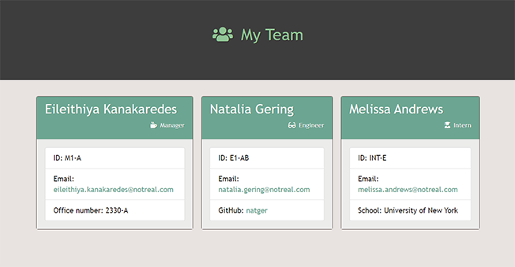

# Template Engine - Employee Summary

This Node CLI will prompt the user for the employee ID, email, and other specific information based on their role within the company. The user can then add additional team members as well. When finished, the application will output an HTML file that displays an organized summary of the team information provided. 

## Installation
* Install [node.js](https://nodejs.org/en/download).
* Open the terminal and navigate to the appropriate directory.
* Run the `npm install` command.
* Run the `node app.js` command.
* Answer each of the prompts presented.

## Technologies Used
* HTML
* CSS
* Bootstrap
* Javascript
* Node.js
* NPM Inquirer Package
* Jest

## Other Links
[Video of application](https://youtu.be/yiDrV3rQhKs) 